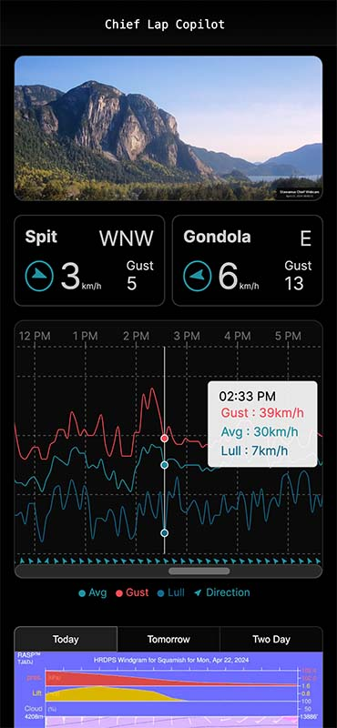

<a name="readme-top"></a>

<h3 align="center">Chief Lap Copilot</h3>
    <p align="center">
  <b><a href="https://chieflap.vercel.app" >chieflap.vercel.app</a></b>
  </p>
  <p align="center">
  A weather dashboard for local pilots built with <a href="https://nextjs.org/" >Next.js</a> and hosted on Vercel.
  </p>
</div>

<!-- ABOUT THE PROJECT -->

<p align="center">
  <a href="https://chieflap.vercel.app/"></a>
</p>
<!-- [![Conversation Page Screenshot][conversation-screenshot]](https://chieflap.vercel.app/) -->

## About The Project

This is a personal project designed to improve the safety of paragliding in my local area by providing up-to-date weather data for pilots. It streamlines the pre-flight process and inflight decision-making by combining data from a number of APIs into one page that has been optimized for mobile devices.

<!-- GETTING STARTED -->

## Getting Started

To get a local copy up and running follow these steps.

### Prerequisites

1. Install the correct version of Node using [NVM](https://github.com/nvm-sh/nvm)

```sh
nvm install 21.6.0
```

### Installation

1. Clone the repo
   ```sh
   git clone https://github.com/columk1/wx-dashboard.git
   ```
2. Install NPM packages
   ```sh
   npm install
   ```
3. Start the development server
   ```sh
   npm run dev
   ```

<!-- ROADMAP -->

## Roadmap

- [ ] Redesign Cards to include full gust range and time of last update
- [ ] Redesign RASP interface to allow more windgram locations
- [ ] Add Valleycliffe wind meter when it is installed
- [ ] Create unit tests and snapshots using Vitest

<!-- CONTACT -->

## Contact

Email: columk1@gmail.com  
Twitter: [@ColumKelly3](https://twitter.com/ColumKelly3)  
Website: [columkelly.com](https://columkelly.com)

Live Project Link: [chieflap.vercel.app](https://chieflap.vercel.app/)

<!-- MARKDOWN LINKS & IMAGES -->
<!-- https://www.markdownguide.org/basic-syntax/#reference-style-links -->

[linkedin-shield]: https://img.shields.io/badge/-LinkedIn-black.svg?style=for-the-badge&logo=linkedin&colorB=555
[linkedin-url]: https://linkedin.com/in/linkedin_username
[conversation-screenshot]: screenshots/homepage.jpg
[React.js]: https://img.shields.io/badge/React-20232A?style=for-the-badge&logo=react&logoColor=61DAFB
[React-url]: https://reactjs.org/
